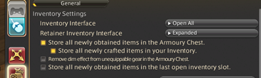

# Chocobo Colouring Automated

Hindi uses installed shaping fonts. The source now leaves other languages usable when the Hindi menu caption is unavailable, showing a disabled ASCII `Hindi (unavailable)` option. Required text for a selected Hindi UI still requires full validation; on failure, the readable status offers **Use English**, saving English only after an explicit press. Native verification and Linux/Wine acceptance remain pending for this change.

Use Settings for shared colour, UI language, compact spacing and window transparency/fade; optional Main selectors change the same saved preferences. The packaged plugin icon appears in Main branding and its expanded/collapsed title without recolouring dye swatches. Calculate creates the feeding plan; the Automation controls start or stop feeding using the existing character, timer and fruit checks.

The approved main and compact calculator designs show colour selection, required
fruits and feeding order in separate panels, with Save/Copy actions reserved at
the bottom. Before calculation the fruit table and feeding order are empty.
Timers, Automation, their troubleshooting guide and Settings retain the existing
actions and data with shared typography and appearance.

Timers keeps character/bird names and status cells on one line. Narrow windows
use native horizontal scrolling to reach every column; longer lists also retain
vertical scrolling and their column headings. Translated tabs keep readable
widths and native navigation arrows. Settings retains scrolling access for long
labels and uses the existing configuration save route.

The header colour/language selector and `C` compact toggle use the existing
configuration save path and are mirrored in Settings. The nine original UI
languages plus Vietnamese, Brazilian Portuguese, Indonesian, Polish and Turkish
have complete embedded UI and status resources. Segoe UI fonts merge Dalamud-managed CJK coverage. The
relative theme changes decorative surfaces and text together while actual dye
swatches, inventory warnings and feeding state colours retain their meanings.
No plugin or configuration version is changed.

Complete offline calculator renders check both densities and narrow panes with
empty and same-colour states. Panel spacing keeps the empty feeding order visible
at the reference sizes; longer Calculate and result actions retain readable
widths with native horizontal scrolling. Translated fruit headers use measured
column widths. These CPU renders and native interaction checks leave managed-host
font readiness and final game screenshot acceptance open.

Local builds require the sibling `aethertekUI` checkout and SDK 10.0.201. Actions
uses this repository's read-only `AETHERTEKUI_DEPLOY_KEY` for the private library,
and the existing plugin artifact copy includes `AethertekUI.dll`. Local build
checks are separate from game visual acceptance; mcvaxius owns installation and
the final screenshot.


---

**Help fund my AI overlords' coffee addiction so they can keep generating more plugins instead of taking over the world**

[☕ Support development on Ko-fi](https://ko-fi.com/mcvaxius)

[XA and I have created some Plugins and Guides here at -> aethertek.io](https://aethertek.io/)
### Repo URL:
```
https://aethertek.io/x.json
```

---

```
https://raw.githubusercontent.com/McVaxius/TheDumpsterFire/refs/heads/master/repo.json
```

- If you havent done this please don't ask why it gets stuck
- 2 things -> OPEN ALL + EXPANDED
- Otherwise it will get stuck after the first feed
- Don't worry it can resume.


## Support logs

Use **Copy / ZIP Dalamud log** in Settings > Settings to create a local ZIP and open its folder. At 100 MiB or above, the first click warns that logging may have stopped and recent activity may be missing; click **Export capped log anyway** only if you still want that snapshot. Share the ZIP manually and remove exports when no longer needed. **Open Export Folder** reopens the completed export’s folder.

When XA Slave is loaded, **Open XA Slave log tools** opens its **Utility > XA Mods** panel, which contains Dalamud Log Cleaner. The existing **Copy / ZIP Dalamud log** action remains separate. Opening the panel does not run cleanup or change XA Slave settings.
